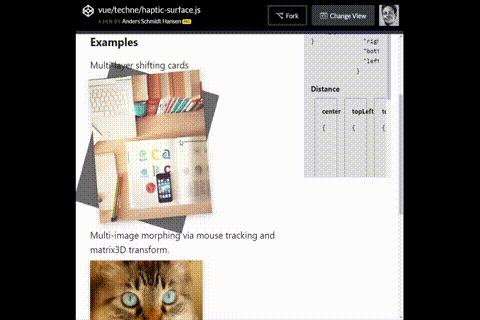

# vue-haptic-surface
A Vue.js component that sends back geometric data from any element it wraps.

## [CodePen Example](https://codepen.io/andersschmidt/full/3c3ee5243ba353d74cc2b2a551dae909/)



## Installation
```js
npm install vue-haptic-surface
```
```js
import VueHapticSurface from 'vue-haptic-surface'

Vue.use(VueHapticSurface)
```

## Usage
```html
<template lang="pug">
  haptic-surface(@sensing="onSense")
    .element(:style="{ transform: `translateY(${haptic && haptic.pointer.y}px)` }")
</template>

<script>
  export default {
    data () {
      return {
        haptic: null
      }
    },
    methods: {
      onSense (data) {
        this.haptic = data
      }
    }
  }
</script>
```

## Quick Tip for nested elements
If you have multiple elements nested inside a `haptic-surface` component, you may end up in a situation where the positions of those nested elements go bonkers. That is because of the nested elements also triggering the `mousemove` when moving around the surface of the upper-most component.

One way of fixing this is to remove the `pointer-events` from those nested elements using a class like this:
```css
.pointer-events-none-children > * { pointer-events: none; }
```

It's just one way of handling that. 

## What data is returned?
The component exposes a couple of different collections of data, primarily from the `mousemove` and `click` events. They are as follows...

### Pointer (e.g. `haptic.pointer`)
Simply exposes the current mouse position, including an inverted version of the `x` and `y` values and a 360 degree calculation. The `degree` value is especially useful for rotations and changing the hue of colors on an element.

```js
{
  "x": 141,
  "y": 27,
  "inverted_x": -141,
  "inverted_y": -27,
  "degrees": 277
}
```

### Center (e.g. `haptic.center`)
Returns the centerpoints of the `haptic-surface` element.
```js
{
  "x": 125,
  "y": 150,
  "inverted_x": -125,
  "inverted_y": -150
}
```

### Shape (e.g. `haptic.shape`)
The basic shape data of the `haptic-surface` component itself. This is just the `getBoundingClientRect()` information without any bell's and whistles.

```js
{
  "x": 32,
  "y": 163,
  "width": 250,
  "height": 300,
  "top": 163,
  "right": 282,
  "bottom": 463,
  "left": 32
}
```

### Distance (e.g. `haptic.distance`)
Returns a boatload of information about the pointer's distance from each corner (and the center) of the `haptic-surface` element. Also includes a percentage calculation in both directions which can be useful in cases where having a 0 to 100% value is more optimal.

```js
// haptic.distance.topLeft
{
  "x": 141,
  "y": 27,
  "inverted_x": -141,
  "inverted_y": -27,
  "to_center_x_pct": 100,
  "to_center_y_pct": 18,
  "from_center_x_pct": 0,
  "from_center_y_pct": 82
}
```

### Corners (e.g. `haptic.corners`)
The same as `Shape`, but returns the `x` and `y` points of the corners of the `haptic-surface` element.

```js
{
  "x": 0,
  "y": 0,
  "inverted_x": 0,
  "inverted_y": 0
}
```

### Memory (e.g. `haptic.memory.clicks`)
Sometimes it's useful to have a list of clicks that happened prior to the current click event. A history of clicks, you could say. It defaults to `5`, but you can set it to whatever using the `maxClickPositionsSaved` prop.

A potential use case is to add ripple effects on buttons or elements, or placing a trail of dots, hotspots or other markers.

```js
{
  "x": 110,
  "y": 96,
  "inverted_x": -110,
  "inverted_y": -96,
  "created_at": 1539539165970
}
```

## License
The MIT License
